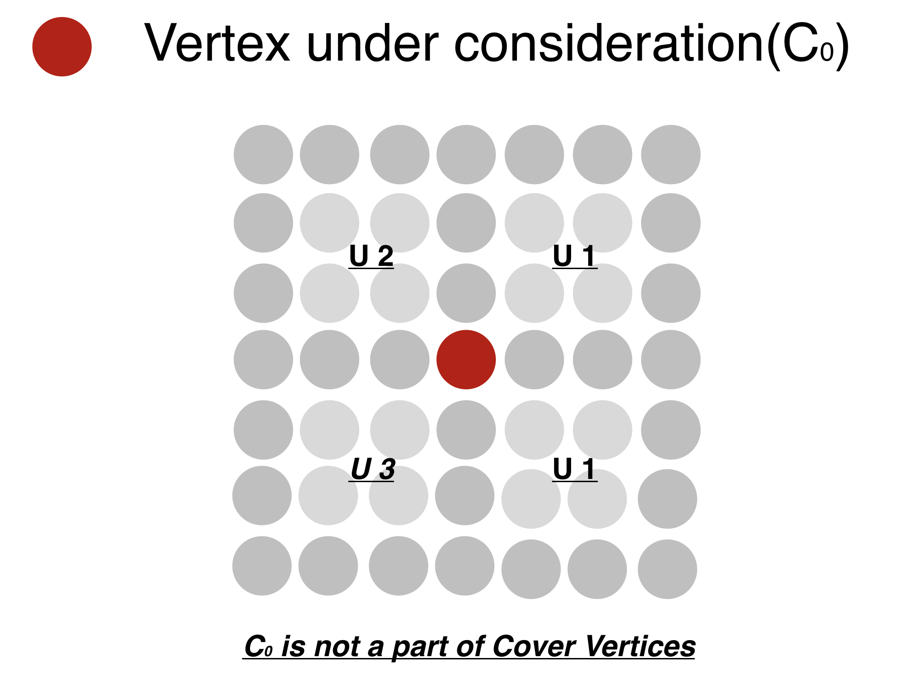

# Outer_Isothetic_Cover
Construction of an Outer Isothetic Cover of a 2-D Digital Object (using C programming language) by the Combinatorial Approach.
Given a 2-D digital object, i.e.  A binary Portable Gray Map (.pgm) image, the program obtains a set of points , P(S’) such that when connected, these polygons form a ‘Tight Outer Isothetic Cover’ of the object within a grid of cell size g given by the user.

Uses of cover formation can be Robot grasping and navigation, Computation of a minimum-area safety region (referred as the classical safety zone problem), minimization of total area of the fabricated parts, and identification of free configuration space (in robotics).

## Concepts:

### Isothetic Polygon

  - Simple polygon of finite size whose alternate sides belong to two parametric families of straight lines
  - Rectilinear polygon : an Isothetic polygon
  - Here, Isothetic polygon means rectilinear polygon
  
### Types of Isothetic Cover:
    - Outer Isothetic Cover: cover tightly, “encloses” the object
    - Inner Isothetic Cover: cover tightly, “inscribes” the object
   
An isothetic cover provides an approximate information about the structural content and geometric characteristics of the object.

### Digital Plane:
  - The digital plane, Z2, is the set of all points having integer coordinates in the real plane R2. 

### Digital points
   - A point in the digital plane is called a digital point, or called a pixel in the case of a digital image.

### Grid Points
  - The point at which a horizontal grid line  and a vertical grid line intersects is called the grid point.   

### Preliminaries
  - An Isothetic polygon S is  a simple polygon of finite size in Z2 whose alternate sides are either horizontal or vertical. The border Bs of S is the set of points belonging to its sides, which forms the polygon around the object.

## Assumptions:

  - The Object has no Holes
  - S is a 8 connected set.
  - The Object has is 2-D in nature and is continuous in nature.
  - Let height be h and width be w . Then the user shall input the value of g such that g < (w,h).
 
## Input Image Format
  - PGM  -> Portable Gray Map
  - In PGM image P2 format of Netpbm
      - Parameter to determine pixel/image size.
      - Parameter to define the maximum value i.e no of grey between white and black.
      - Then for all the pixels                                    
          Numbers entered <= max value to determine the colour of that pixel 

## Output image format
  - SVG -> Scalable Vector Graphics
  - Advantage of SVG over PGM
      - SVG has a property of not loosing size when zoomed
      - Easy to perform vector based graphics.
      - Can be edited with any text editor
      - SVG images are scalable

## Conversion of PGM to SVG
  - Check PGM image to find the polygon points.
  - Copy the polygon points to SVG image. 
  - Connect all the points and fill it with solid colour.

## Steps Involved

  - Deciding and filtering the input image as per a predefined Threshold value.
  - Obtain a Binarized image P.
  - Store the PGM image in an array.
  - Draw a canvas with a grid lines as defined by user.
  - Draw the image based on the points obtained for the boundary of the image by using the near 8 connectivity principle.
  - Obtain the  Cover Points.

### Obtaining Binarized Image:
  - While scanning or reading the PGM image set the value of all pixels greater than 240( varies with input image) to 1 and the rest to 0.This gives us a sharp image.

### Drawing the image on the Canvas by 8 connectivity principle
Scan the image (i.e. Array of pixels) in Left-Right, Top-Bottom order to find the Leftmost top point of the image (say it is Vin)
  
  

### Checking of the grid point
We will check all the four squares(u1 , u2 , u3 , u4)to which the grid point is common, each square is checked for all its sides. If any of its side is found to have an intersection with the image, then a true value is returned.
  

### Algorithm for traversal along the grid line 
I = S, top left point of S, g

##### Steps:
  - Determine the start vertex and start direction
  - Go to next grid point
  - while (current grid point ≠ start vertex)
    - Label the current grid point
    - Determine the next direction of traversal
    - Go to the next grid point
    - Current grid point = next grid point

### Types of vertex
A vertex is classified according to the neighbouring UGBs occupancy.
A UGB is said to be occupied if any of the pixel in that vertex has a pixel or cell occupied by the object.
We check occupancy by deciding whether the boundaries of a cell have been intersected or not.
 
(I) _C0  : Vertex with no neighbouring occupancy_
  
  
(II) C1  : Only one cell is occupied. In such case suppose if previous direction of traversal was d, and the current cell occupied was of type t, then the next vertex will be in direction = (d+t)%4, Here t = 1, d = 3;

  
(III) C2A:	With adjacent occupancy. If two adjacent cells are occupied then new direction of traversal = (d+t)%4=0
  d=0,t=0

  
(IV) C2B: With Diagonal Occupancy. Here, we have assume t=4, Hence, New direction = (d+4) % 4  

  
(V) C4: All cells are occupied. If all the neighbouring points are occupied then the point must be the interior point of the cover.

## Results:
### Initial Image:

### After drawing grid:

### Final result with cover

